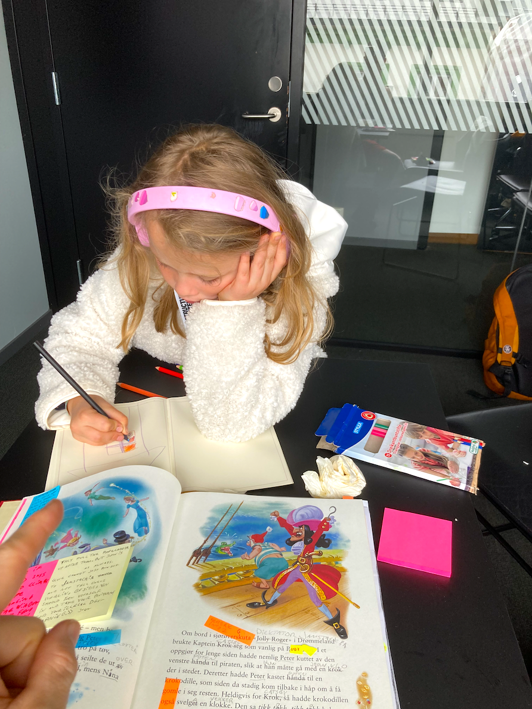
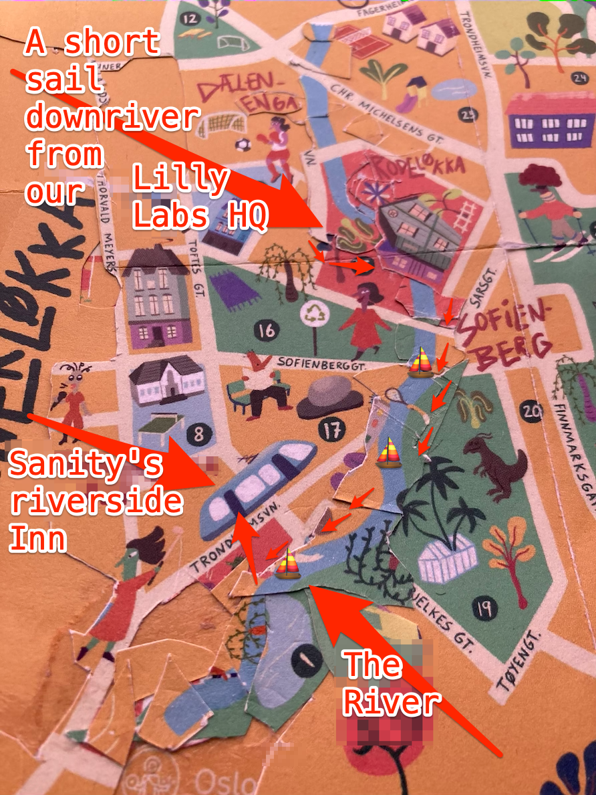
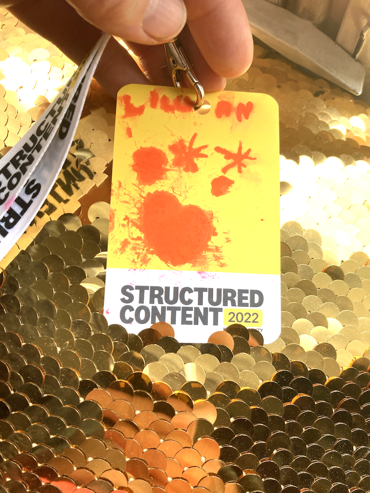

## The Conference was in Sanity's riverside Inn

A short sail downriver from our Lilly Labs Home Office downtown Oslo, Norway. First thing inside Lillian (7 🏴‍☠️👸) and Benedicte found chocholate cake 🍰😺👍! There were lots of piraty devs to mingle with, but when they all started sitting down....

I found a soundproofed room where Lillian and I spread out our notes and started working on our side-project-books.





Our short sail downriver from our Lilly Labs HQ to Sanity's riverside Inn. (See below code for credits.)


Lillian (7 🏴‍☠️👸) is drawing a tall tale about two girls who find a hidden key to a dangerous door that leads to a forest with a monster filled labyrith.

## Lillian's idea: 🐸💩 is `coreSupportsOnPluginInit`

I am writing a Gatsby source plugin upgrade workbook. One thing I use my book writing process for is collecting ideas from Lillian. Lillian is a never ending source of unexpected ideas like using a poop emoji with a 🐸💩 to represent `coreSupportsOnPluginInit`. If `coreSupportsOnPluginInit === "stable"` Ruby can safely navigate around the monsters in the underground data layer labyrinth.

This 🐸💩-idea helped me in my treasure hunt to make my Cloudinary Gatsby plugin upgrade coding more unforgettable for me.

I like to take a tiny part of the code I am working on and play around with it again & again & again to make it "stick to my fingertips."

## Lillian's 🐸💩-idea in action

On way of playing around is adding visuals like emojis to the code. Here you can see Lillian's 🐸💩-idea in action together with some other ideas we came up with during the Structured Content Conference.

```js


let emojisRepresent = {
  // swap out some of the emojis with code
  '🐸💩': coreSupportsOnPluginInit,  // how: 🐸: coreSupportsOn
                                    // how: 💩: PluginInit
  '🐲👑': 'unstable',                // how: 🐲👑: is .... mentally 'unstable'
  '🏴‍☠️👸': 'stable',                  // how: 🏴‍☠️👸: is mentally 'stable'
  '🚴‍♀️⛵': isGatsbyNodeLifecycleSupported, // how: 🚴‍♀️  cycle your ⛵, not much wind in Labyrinth
};

let 🐸💩 = '🐲👑' | '🏴‍☠️👸' | undefined;

try {
  const { 🚴‍♀️⛵ } = require(`gatsby-plugin-utils`); // 🔧 💾 ?
  if (🚴‍♀️⛵(`onPluginInit`)) {
    🐸💩 = '🏴‍☠️👸';
  } else if (🚴‍♀️⛵(`unstable_onPluginInit`)) {
    🐸💩 = '🐲👑';
  }
} catch (error) {
  console.error(`could not check if Gatsby supports onPluginInit lifecycle 🚴‍♀️`);
}

// 💩🐸´s 🧶 to help Lizzie and Ruby to find their way through laby
// you have these `globalPluginOptions` in your options.js in your site
// let globalPluginOptions = {}

const initializeGlobalState = (_, pluginOptions, reporter) => {
  // setPluginOptions({ pluginOptions, reporter });
  globalPluginOptions = pluginOptions;
};

if (🐸💩 === '🏴‍☠️👸') {
  exports.onPluginInit = initializeGlobalState;
} else if (🐸💩 === '🐲👑') {
  exports.unstable_onPluginInit = initializeGlobalState;
} else {
  exports.onPreBootstrap = initializeGlobalState;
}
// enter 💜-labyrinth = initializeGlobalState

// P.S.
// This is step 3. Global State
// of our Gatsby v4 plugin upgrade code with emojis
// yarn add gatsby-plugin-utils inside packages/gatsby-transformer-cloudinary
// gatsby-plugin-utils will help you keep backwards compatibility with Gatsby 3 while moving forward to a Gatsby 4 world

```

Lillian's name badge took a beating and got smudged.




This massage chair is here set to "The Boss Programme". Quite a success!


Credits:

The map I so malicously maltreated above was originally made by these great professionals:

Illustration
Marius Pålerud

Design
Elisabeth Moseng

Illustrationsagent
Cathrine Louise Finstad
