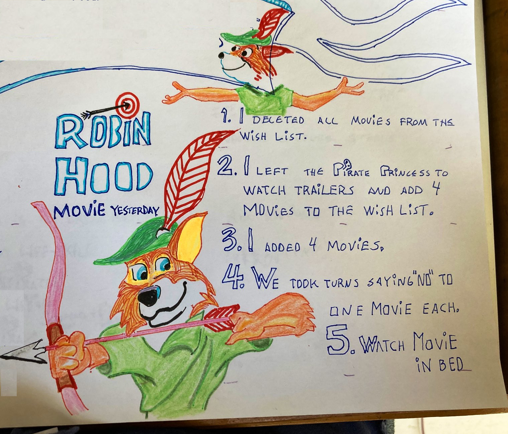

# Saying "NO" is the First Step Towards Saying "yes", According to Robin Hood 💡

Making a choice is not always easy, but it's always an important life-skill for a Dev-Rel-Pirate. And like every skill, the way to get better at choices is deliberate practice.

## Practice Making Choices With a Kid
We watched my favourite Robin Hood movie yesterday. The Pirate Princess and me. And the way we found that movie is today's tip for a more skillful Dev-Rel-Life.

## Five Steps Towards Making a Choice About What Movie to Watch With a Kid

1. I deleted all the movies from the wish list. (Inside Disney Plus)
2. I asked the Pirate Princess to watch trailers and add 4 movies to the wish list. (The Pirate Princess loves trailers)
3. I added 4 movies myself.
4. The Pirate Princess and I took turns saying "no" to one movie each. Until we had one movie left, Disney's animated Robin Hood from 1973.
5. We watched Robin Hood in bed.

I remember watching that Robin Hood movie in the cinema with my dad. MAN I loved that movie. I drew Robin Hood EVERY day for months in day care. And I drew that hypnist snake Hiss also. I drew Hiss with his spiralling eyes. I wish I had some of those drawings today to show The Pirate Princess.

Here are today's drawings, not even half as imbued with passion and hero worship.

