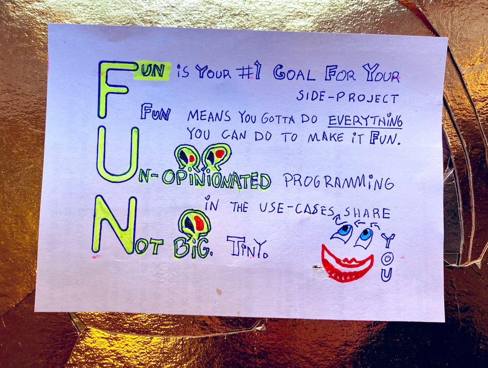
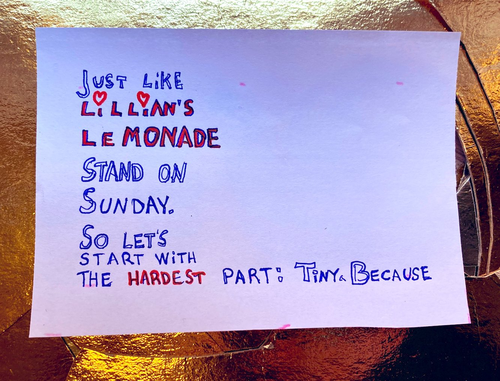
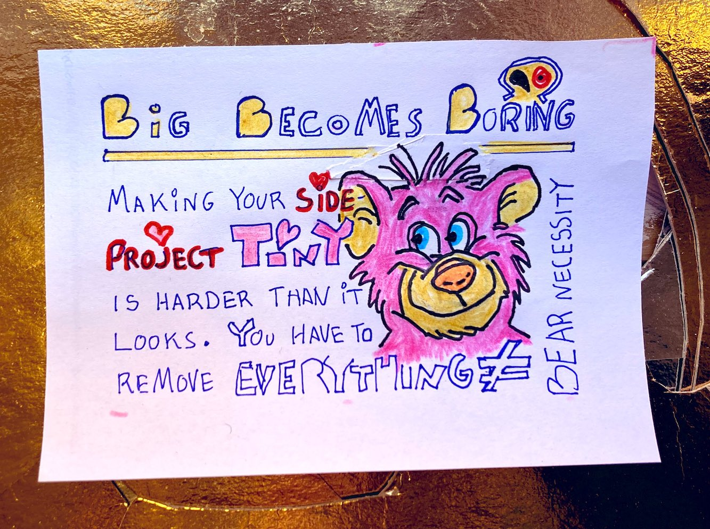

# Because Fun is Better than Boring

Let's say Fun is your number 1 goal for your side-project. Fun means you gotta do EVERYTHING you can do to make it Fun. Or it'll become boring, you wait and see. These three go together:

- Fun
- Un-opinionated programming in your use-cases you share
- Not Big. Tiny

Read downwards. FUN.

Your side-project is just like Lillian's Lemonade stand on Sunday. So let's start with the hardest part of FUN: Tiny.

## Big Become Boring

Making your side-project Tiny is harder than it looks. You have to remove EVERYTHING except the bare necessities.

So let's start removing one bite at the time. I Lillian started with time.

## Save Time Selling Lemonade

- Make less lemonade, sell less lemonade
- Move to a better location than last year
- Lower the lemonade price from last year
- Give an even lower price for buying 2 cups of lemonade
- Give an even lower price for buying 3 cups of lemonade
- Give an even lower price for buying 4 cups of lemonade
- Give an even lower price for buying 5 cups of lemonade

How does Lillian's list translate to your coding?

## How Do You Save Hours On Your Coding Side-Project?

- Peak time of day = Less Hours
- Less coding tasks = Less Hours

### Peak time of day = Less Hours

Find your Peak time of day, the time of day you usually perform at your best. Block out a couple of hours two days a week for your side-project. If you have to tell your boss, do it. If your boss is better off not knowing, don't say a word  😺🏴‍☠️. Working on Your Coding Side-Project at your Peak time of day will save you hours because:

- You'll produce less bugs, saving you hours down the road
- Your coding will be tighter, saving you time
- Your decision making will be better, saving you time

### Less Coding Tasks = Less Hours

That less coding tasks will save you hours sounds obvious, but how do you do it? Some ideas to save you coding tasks:

- Copy paste the less interesting pieces of your Coding Side-Project from somebody else
- No code tools like ... and ... We use squarespace for our company website lillylabs.no
- Refuse to build parts of your Coding Side-Project

Lillian's Lemonade stand on Sunday

More photos Lillian's Lemonade stand

