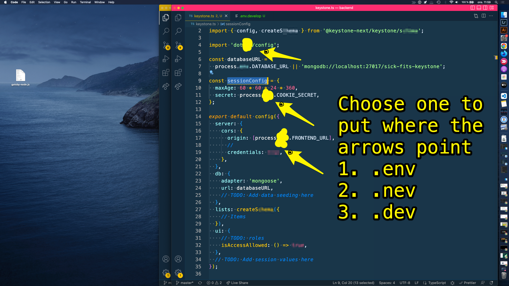

Day 8 of

Visualizing Route Changes


A #sketchNote with some old school react wisdom from The Original


The "You Are Data" part is my own observation.


Day 10 of

Registered an account at #apolloAtlas and added stuff from there to my .env


Day 11 of

I wrote this GraphQL mutation to change an email

mutation {
    RequestReset(email: _ _ _) {
            message
    }
}


Day of 13

I made a schema for my users.
My user data type.
I put my User.ts file in my "schemas" folder.


You can make a schema for your users, just choose 1, 2 or 3 to put on the yellow blob.


Get your secret variables, just choose 1, 2 or 3 to put on the yellow blob.



credentials and isAccessAllowed, just choose 1, 2 or 3 to put on the yellow blob.


The Pirate Princess took some photos right ater we streamed our Jamstack Pirates Show on Thursday


Day 14 of 100daysOfReact riddles
rattraps
rabbitholes

Jam
jungle
jigsaws
jumbles
juxtapositions?

I added auth today

I opened my keystone.ts file in the root of my backend project. I am going to add the auth secret sauce from keystone. Here are the steps I took.

- I created a method called `withAuth`

- With another method called `createAuth()`

- Import `createAuth` from keystone

- Inside my method an object.

- The schema responsible for being `User`

- Wrap the server `config` in `withAuth()`


I added identityField


I added auth today

I opened my keystone.ts file in the root of my backend project. I am going to add the auth-secret-sauce-r-🛸 from keystone 🔑⛰️ . Here are the steps I took.


- I created a method called `withAuth`

```js
const { _ _ _ _ _ _ _ _ } =
```


- With another method called `createAuth()`

```js
const { withAuth } = _ _ _ _ _ _ _ _ _ _ ();
```


- Import `createAuth` from keystone

```js
import { _ _ _ _ _ _ _ _ _ _ } from '@keystone-next/auth';

```


- Inside my method an object.

```js
const { withAuth } = createAuth( _ _ );
```


- The schema responsible for being `User`

```js
const { withAuth } = createAuth({
    listKey: _ _ _ _ ,
});
```


- Add `identityField` property with value `email`

```js
const { withAuth } = createAuth({

  identityField: ' _ _ _ _ _ ',

});
```


- Add `secretField` property with value `password`


```js
const { withAuth } = createAuth({


  secretField: ' _ _ _ _ _ _ _ _ ',

});
```


- Add `initFirstItem` property which is an object
- Add `fields` property with an array of values `name`, `email` and `password`

```js
const { withAuth } = createAuth({


  initFirstItem: {
    fields: ['name', 'email', 'password'],
  },
});
```


- Wrap the server `config` in `withAuth()`

```js

export default  _ _ _ _ _ _ _ _ (
    config({
        // server and stuff
    })
)
```


