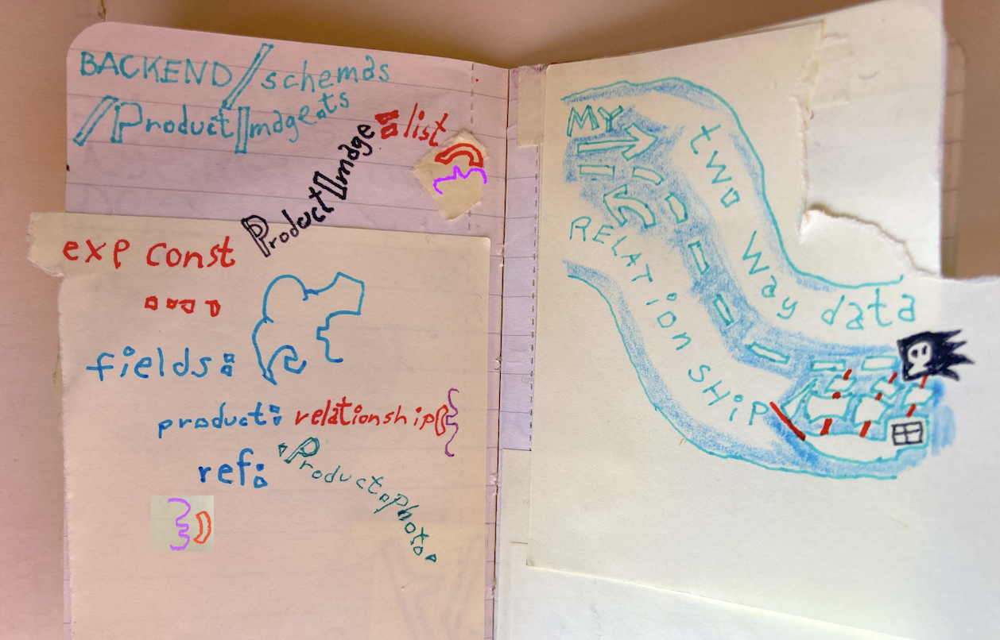
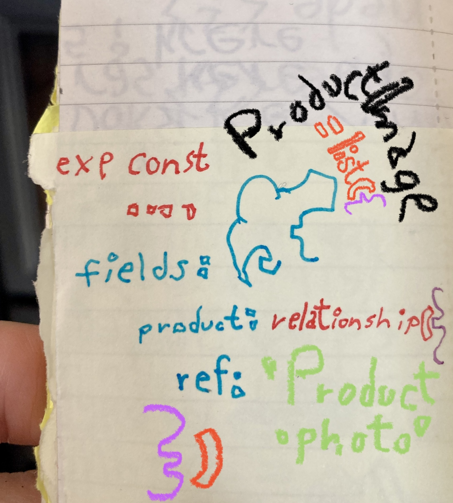

## Fetching Data with hooks and Displaying it in our Front End
Day 20 #100daysofreact

```js
// FRONTEND / pages / products.js

import Products from '../components/Products';

export default function OrderPage() {
  return (
    <div>
      <Products />
    </div>
  );
}


// FRONTEND / components / Product.js

import ItemStyles from './styles/ItemStyles';

export default function Product() {
  return (
    <ItemStyles>
      
    </ItemStyles>
  );
}

import Link from 'next/link';
import formatMoney from '../lib/formatMoney';
import ItemStyles from './styles/ItemStyles';
import Title from './styles/Title';
import PriceTag from './styles/PriceTag';

export default function Product({ product }) {
  return (
    <ItemStyles>
      
      <Title>
        <Link href={`/product/${product.id}`}>{product.name}</Link>
      </Title>
      <PriceTag>{formatMoney(product.price)}</PriceTag>
      <p>{product.description}</p>
    </ItemStyles>
  );
}

// FRONTEND / components / Products.js

import { useQuery } from '@apollo/client';
import gql from 'graphql-tag';
import styled from 'styled-components';
import Product from './Product';

const AI_PRODUCTS_QUERY = gql`
  query ALL_PRODUCTS_QUERY {
    allProducts {
      id
      name
      price
      description
      photo {
        id
        image {
          publicUrlTransformed
        }
      }
    }
  }
`;

const ProductsListStyles = styled.div`
  display: grid;
  grid-template-columns: 1fr 1fr;
  grid-gap: 60px;
`;

export default function Products() {
  const { data, error, loading } = useQuery(AI_PRODUCTS_QUERY);
  console.log(data, error, loading);
  if (loading) return <p>Loading...</p>;
  if (error) return <p>Error: {error.message}</p>;
  return (
    <div>
      <ProductsListStyles>
        {data.allProducts.map((product) => (
          <
            Product key={product.id}
            product={product} />
        ))}
      </ProductsListStyles>
    </div>
  );
}


```

## Two way data relationships in keystone

Day 18 #100daysofreact


```js

// BACKEND / schemas / Product.ts

import { relationship, text } from '@keystone-next/fields';
import { list } from '@keystone-next/keystone/schema';

export const Product = list({
  // TODO access
  fields: {
    name: text({ isRequired: true }),
    description: text({
      ui: {
        displayMode: 'textarea',
      },
    }),
    photo: relationship({
      ref: 'ProductImage.product',
    }),
  },
});

// BACKEND / schemas / ProductImage.ts

import { relationship, text } from '@keystone-next/fields';
import { list } from '@keystone-next/keystone/schema';
import { cloudinaryImage } from '@keystone-next/cloudinary';
import 'dotenv/config';

export const cloudinary = {
  cloudName: process.env.CLOUDINARY_CLOUD_NAME,
  apiKey: process.env.CLOUDINARY_API_KEY,
  apiSecret: process.env.CLOUDINARY_API_SECRET,
  folder: 'bleh',
};

export const ProductImage = list({
  fields: {
    image: cloudinaryImage({
      cloudinary,
      label: 'Source',
    }),
    altText: text(),
    product: relationship({
      ref: 'Product.photo',
    }),
  },
});


```


```js


```

Day 17 #100daysofreact

I created a Two way relationships in keystone






## Uploading Cloudinary Images

Day 16 #100daysofreact

- In my schemas folder I make a ProductImage.ts file
- I make my `ProductImage`
- It's a `list`
- I `import`my list
- And then inside of that `fields``
- I have my `image`
- And that is `cloudinaryImage({})`
- And inside of that `cloudinary` config
- `label` is going to be 'Source'
- I also want to pass a spot to pass `altText`
- And that is a `text()` field
- I imported `text`
- I imported `cloudinaryImage`
- I imported

```js


export const ProductImage = list({
  fields: {
    image: cloudinaryImage({
      cloudinary,
      label: 'Source',
    }),
    altText: text(),
  },
});

```


9
Fixing Styled Components Flicker on Server Render06:30
0%

MODULE #4
Server Side GraphQL Development

10
Setting up MongoDB13:02
91%

11
An Intro to GraphQL06:51
0%

12
Setting up Keystone and Typescript11:28
83%

13
Creating our first User data type05:49
100%

14
Adding Auth to our Application08:09
0%

15
Creating our Products Data Type07:33
91%

16
Uploading Product Images07:59
3%

17
Creating two way data relationships in Keystone06:39
0%

18
Inserting Seed Data07:39
46%

MODULE #5
Client Side React + GraphQL Development

19
Setting up Apollo Client18:35
0%

Fetching Data with hooks and Displaying it in our Front End29:53
2%

21
Fixing and Styling the Nav02:00
0%

22
A real good lesson in React Forms and Custom Hooks24:13
52%

23
Hooking up our File input and Form Styles10:41
0%

24
Creating Products via our Mutations17:29
0%

25
Refetching Queries after a Successful Mutation05:17
0%

26
Programmatically Changing the Page after product creation02:37
0%

27
Displaying Single Items, Routing and SEO25:57