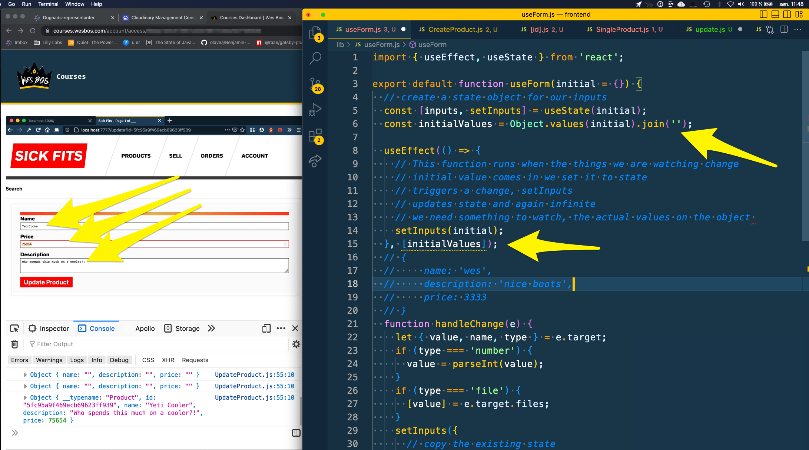

## Sub-Task:

The useEffect function runs when the things we are watching change
    - initial value comes in we set it to state
    - triggers a change, setInputs
    - updates state and again infinite
    - we need something to watch




### Solution below

```js
// lib / useForm.js

import { useEffect, useState } from 'react';

export default function useForm(initial = {}) {
  // create a state object for our inputs
  const [inputs, setInputs] = useState(initial);
  const initialValues = Object.values(initial).join('');

  useEffect(() => {
    // This function runs when the things we are watching change
    // initial value comes in we set it to state
    // triggers a change, setInputs
    // updates state and again infinite
    // we need something to watch, the actual values on the object
    setInputs(initial);
  }, [initialValues]);
  // {
  //     name: 'wes',
  //     description: 'nice boots',
  //     price: 3333
  // }
  function handleChange(e) {
    let { value, name, type } = e.target;
    if (type === 'number') {
      value = parseInt(value);
    }
    if (type === 'file') {
      [value] = e.target.files;
    }
    setInputs({
      // copy the existing state
      ...inputs,
      [name]: value,
    });
  }
  function resetForm() {
    setInputs(initial);
  }

  function clearForm() {
    const blankState = Object.fromEntries(
      Object.entries(inputs).map(([key, value]) => [key, ''])
    );
    setInputs(blankState);
  }
  // return the things we want to surface from this custom hook
  return {
    inputs,
    handleChange,
    resetForm,
    clearForm,
  };
}


```


```js
// pages / product/[id].js

// You can only query single items based on unique fields


```


```js

import Router from 'next/router';  // Add this

export default function CreateProduct() {

  const [createProduct, { loading, error, data }] = useMutation(
    CREATE_PRODUCT_MUTATION,
    {
      variables: inputs,
    }
  );

  return (
    <Form
      onSubmit={async (e) => {
        e.preventDefault();
        // Submit the inputfields to the backend:
        const res = await createProduct();
        clearForm();
        // Go to that product's page
        Router.push({  // Add this
          pathname: `/product/${res.data.createProduct.id}`,  // Add this
        });
      }}
    >
}
```


```js
// components / CreateProduct.js
import gql from 'graphql-tag';
import { useMutation } from '@apollo/client';
import Form from './styles/Form';
import useForm from '../lib/useForm';
import DisplayError from './ErrorMessage';

const CREATE_PRODUCT_MUTATION = gql`
  mutation CREATE_PRODUCT_MUTATION(
    # Which variables are getting passed in? And What types are they
    $name: String!
    $description: String!
    $price: Int!
    $image: Upload
  ) {
    createProduct(
      data: {
        name: $name
        description: $description
        price: $price
        status: "AVAILABLE"
        photo: { create: { image: $image, altText: $name } }
      }
    ) {
      id
      price
      description
      name
    }
  }
`;
export default function CreateProduct() {
  const { inputs, handleChange, clearForm, resetForm } = useForm({
    image: '',
    name: 'Nice Shoes',
    price: 34234,
    description: 'These are the best shoes!',
  });
  const [createProduct, { loading, error, data }] = useMutation(
    CREATE_PRODUCT_MUTATION,
    {
      variables: inputs,
    }
  );
  return (
    <Form
      onSubmit={async (e) => {
        e.preventDefault();
        console.log(inputs);
        // Submit the inputfields to the backend:
        await createProduct();
        clearForm();
      }}
    >
      <DisplayError error={error} />
      <fieldset disabled={loading} aria-busy={loading}>
        <label htmlFor="image">
          Image
          <input
            required
            type="file"
            id="image"
            name="image"
            onChange={handleChange}
          />
        </label>
        <label htmlFor="name">
          Name
          <input
            type="text"
            id="name"
            name="name"
            placeholder="Name"
            value={inputs.name}
            onChange={handleChange}
          />
        </label>
        <label htmlFor="price">
          Price
          <input
            type="number"
            id="price"
            name="price"
            placeholder="price"
            value={inputs.price}
            onChange={handleChange}
          />
        </label>
        <label htmlFor="description">
          Description
          <textarea
            id="description"
            name="description"
            placeholder="Description"
            value={inputs.description}
            onChange={handleChange}
          />
        </label>

        <button type="submit">+ Add Product</button>
      </fieldset>
    </Form>
  );
}

```