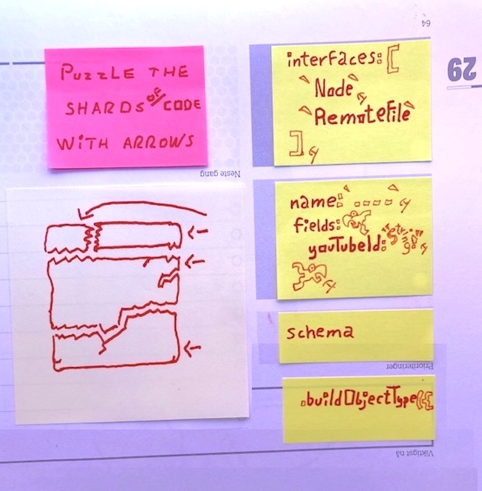
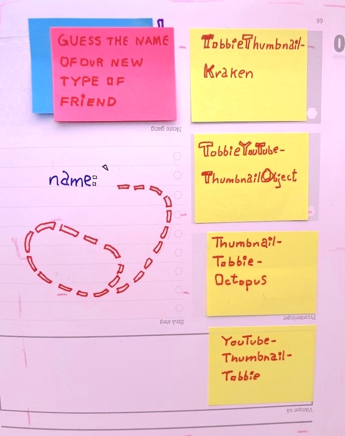

## GATSBY IMAGE CDN

### AGAIN && AGAIN!

A print-out Gatsby-plugin-workbook

- For a Gatsby-Plugin Pirate-Dev or
- For a Dev Rel at a headless CMS

Chapter 1 of 33

Learning
By Doing
through
Gatsby-
Plugins
quickstart

Before diving deep down into IMAGE CDN
Let’s talk about:
- what doing ONE dev-task again && again is like. And
- how you can automate in your dev-brain that ONE dev-task by doing it again && again. On and on.


What is it like?
Doing your dev-task again && again is a little like playing Happy Birthday on a piano until the melody sticks to your fingers.

Why do we devs so seldom do our dev-tasks again && again?

Because….

But wait! Since I am a plugin-pirate captain I can say «Let’s skip ahead to my next question!»

**What can you do to find out if a thing is actually doable?**

Or more specifically….


Will DOING a dev-ask again && again help you automate it in your dev-brain?
“The best way to find out? DOING it!”  – Captain Ola Vea senior.

**Here we go!**

Yo-Ho!
Yo-Ho!
A pirate’s life for me!

## IMAGE CDN

### Gatsby-Plugin Upgrade

- Is WHAT you’re DOING. And
- WHY is faster builds ++

«Nothing weirdly piraty about our WHAT and WHY.» You say?
No, but our HOW will be slightly more piraty than you’re used to.

Firstly you’ll not be coding the first few times, you’ll be guessing.
Secondly you’ll not even TRY to finish the whole IMAGE CDN Upgrade, you’ll only do the first third of the dev-task.

## How: You’ll only do

### The first 3 sub-tasks today:

#### G. A new GraphQL _ _ _ _ _ _ type

#### I. Inside?

#### M. Must I?


## G. A new GraphQL _ _ _ _ _ _ type

### Guess her type

```js
GraphQL node type
GraphQL kraken type
GraphQL octopus type
GraphQL object type
```


### Puzzle the shards with arrows

```js
        interfaces: [`Node`, `RemoteFile`],

        name: `....`,
        fields: {
          youTubeId: "String!",
        },

      schema

                  .buildObjectType({
```




### Guess the name of our new type of friend

```js
TobbieThumbnailKraken
TobbieYouTubeThumbnailObject
ThumbnailTobbieOctopus
YouTubeThumbnailTobbie
```




### Guess the "actions...." to "create" Tobbie

```js
actions.createKraken(
actions.createNode(
actions.createNodeField(
actions.createTypes(
```


### Inside which const do you put Tobbie's roof?

```js
const createYouTubeNode = async (gatsbyUtils, pluginOptions, youTubeId) => {
const fetchEmbed = async (id) => {
const createYouTubeThumbnailNode = (gatsbyUtils) => {
const createYouTubeTypes = (gatsbyUtils) => {
```

### Inside which _ _ - will Tobbie live?

```js
{}
[]
()
##
```

### Inside which "exports...." do we call Tobbie?

```js
exports.pluginOptionsSchema = ({ Joi }) => {
exports.createSchemaCustomization = (gatsbyUtils) => {
exports.sourceNodes = async (gatsbyUtils, pluginOptions) => {
exports.onCreateNode = (gatsbyUtils) => {
```

### Must I `addRemoteFile........Interface(` to Tobbie?

```js
addRemoteFilePlayfillInterface(
addRemoteFilePolyfillInterface(
addRemoteFilePollyfilInterface(
addRemoteFilePiratyInterface(
```

### Must we require ….

```js
"gatsby-plugin-tools/polyfill-remote-file"
"gatsby-plugin-utils/polyfill-remote-file"
"gatsby-utils/polyfill-remote-file"
"gatsby-plugin-timeship/polyfill-remote-file"
```